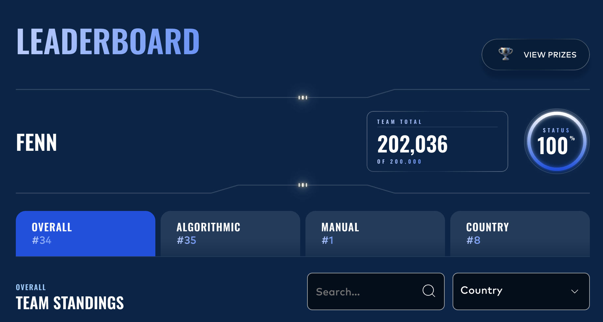

# Prosperity 2026

Repository for [IMC Prosperity](https://prosperity.imc.com/) trading competition.

Prosperity 4 is an online trading contest set in a simulated trading environment. Participants submit trading algorithms in a Python file that runs in the contest environment, and profits ranked against all competitors. This year's contest had 6,151 teams, and I competed solo.

## Phase 1

This round had two products to trade and profiting from these products required market-making strategies. The best strategies accurately estimate a fair midprice around which to trade. That meant handling cases like an emptying orderbook and separating noisy offers from prices anchored to fair value. I focused on a midprice that stayed stable under noise and regime shifts by leaning on orderbook history when liquidity dried up or reference prices disappeared.

## Phase 1 — result

I finished **34th** out of 6,151 teams on the overall leaderboard, with **202,036** in contest currency.

That qualified me directly for Phase 2, starting April 24.

